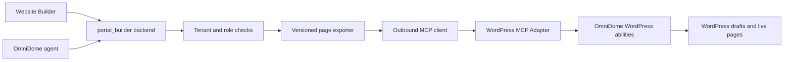

# WordPress MCP integration for the Website Builder

Reviewed 8 October 2026. This is an integration assessment and proposed implementation plan; no application code or WordPress installation was changed.

## Recommendation

Yes: add WordPress as a publishing destination in OmniDome's Website Builder. Keep DomeDesign Studio as the authoring interface and use the portal_builder backend to connect to WordPress through MCP. Start with creating and updating WordPress drafts, then add reviewed publication.

This would let an ISP create a fibre promotion in the existing builder, send it to its WordPress site, check the WordPress preview, and publish from OmniDome. Later, the same connection could support agent-assisted content updates and selected SEO actions.

The supplied Google share URL could not be opened by the research tool. I located the matching official WordPress announcement and verified the adapter documentation directly.

## What WordPress released

WordPress announced the canonical MCP Adapter plugin on 7 October 2026. It supplies MCP server infrastructure for WordPress abilities; it does not supply a client or a complete agent UI. The announcement describes the project as experimental pending v1.0. [Official announcement](https://make.wordpress.org/ai/2026/10/07/the-mcp-adapter-plugin-is-now-available-on-wordpress-org/).

The current plugin metadata lists version 0.7.0, WordPress 6.9 or newer, and PHP 7.4 or newer. Installation alone does not provide every website operation: core or companion plugins must register the abilities we want to call. Exposure is opt-in, and permission checks still apply. [Plugin requirements and installation](https://github.com/WordPress/mcp-adapter/blob/trunk/readme.txt).

The default endpoint is `/wp-json/mcp/mcp-adapter-default-server`. It exposes three MCP tools: `mcp-adapter-discover-abilities`, `mcp-adapter-get-ability-info`, and `mcp-adapter-execute-ability`. A client discovers available abilities, inspects their schemas, and invokes an ability through the execution tool. [Default server guide](https://github.com/WordPress/mcp-adapter/blob/trunk/docs/guides/default-server.md).

## What is already in our code

| Existing component | Evidence | Integration opportunity |
| --- | --- | --- |
| Website Builder workspace | `apps/web/components/modules/portal-module.tsx` mounts design, preview, and SEO studios | Add connected-site settings and destination selection |
| Save and publish flow | `apps/web/components/modules/portal/use-design-studio.ts:70` saves the draft before calling the publish endpoint | Add a separate WordPress draft/publication operation |
| Frontend API | `apps/web/lib/portal-api.ts:57` models content, theme, SEO, and publication metadata; publish call at line 293 | Add typed connection, remote draft, preview, and publication results |
| Structured renderer | `apps/web/components/modules/portal/portal-blocks.tsx:28` renders hero, gallery, features, pricing, FAQ, and CTA blocks | Build a versioned WordPress export mapping |
| Backend publishing | `services/portal_builder/main.py:695` requires manager access, snapshots content, and publishes a native portal page | Reuse authorization and version concepts for a separate destination |
| Page storage | `services/portal_builder/main.py:110` stores tenant-owned pages; line 144 defines page versions | Add tenant-owned WordPress connections and publication mappings |
| AI design | `services/portal_builder/design.py` generates structured proposals and explicitly does not publish | Preserve proposal generation; call a controlled connector for external changes |

The current native publish result points to `/portal/{slug}`. WordPress publication needs its own destination state and URL: a page may be a draft locally, live on WordPress, or published to both destinations. A single shared `status` would lose this distinction.

The agent orchestrator already exposes an MCP server, but I found no outbound MCP client imports in the inspected orchestrator or portal_builder code. Serving MCP tools and connecting to WordPress are separate capabilities.

## Proposed architecture

Build a small OmniDome WordPress companion plugin and install MCP Adapter separately. Declare `Requires Plugins: mcp-adapter` in the companion plugin instead of bundling another adapter copy. This follows the canonical-plugin migration guidance. [0.7.0 migration guide](https://github.com/WordPress/mcp-adapter/blob/trunk/docs/migration/v0.7.0.md).

The companion plugin should define a narrow set of proposed abilities:

| Proposed ability | Purpose |
| --- | --- |
| `omnidome/site-info` | Return site identity, integration version, and supported export features |
| `omnidome/list-pages` / `omnidome/get-page` | Read authorized pages and detect external changes |
| `omnidome/upsert-page-draft` | Create or update a managed draft using a stable external page ID |
| `omnidome/publish-page` | Publish the reviewed remote version |
| `omnidome/get-publication-status` | Reconcile ambiguous network outcomes |

These names are proposed integration contracts, not abilities supplied by the official adapter. Separate media and SEO abilities can follow once their schemas and permissions are defined.

Register a category before registering abilities, supply input/output schemas and permission callbacks, and explicitly opt the intended abilities into MCP. MCP exposure does not grant anonymous execution. [Ability registration guide](https://github.com/WordPress/mcp-adapter/blob/trunk/docs/guides/creating-abilities.md).

Use a backend MCP client with a verified compatible SDK. Version 0.7.0 supports `2025-11-25` and `2026-07-28`; their lifecycle behavior differs. Prefer a tested `2025-11-25` session-based connection for the first release, and add the newer stateless lifecycle when the chosen SDK supports it. Do not assume all protocol versions use the same handshake. [Protocol migration details](https://github.com/WordPress/mcp-adapter/blob/trunk/docs/migration/v0.7.0.md).

## Content and rendering

MCP provides the connection, not a conversion from our React components to WordPress pages. Our Tailwind classes, themes, CTA links, and interactive forms will not automatically transfer.

For the initial release, translate supported sections into Gutenberg core blocks with an explicit theme/style mapping. Export title, slug, headings, paragraphs, lists, images, galleries, and links. Implement and validate mappings for pricing, FAQ, and CTA layouts. If exact visual parity is required, add dedicated OmniDome blocks and a stylesheet in the companion plugin.

Show unsupported-section warnings before exporting. Render the preview through WordPress so the user sees the target theme's actual output. Check responsive layouts, relative image and link URLs, and theme overrides. Uploaded assets should be mapped to WordPress media IDs rather than relying on temporary preview URLs.

Lead forms need a WordPress rendering and submission integration: create leads through an authorized backend path with validation and abuse controls. Do not embed OmniDome tenant credentials in public markup. SEO fields need documented mappings; plugin-specific SEO data requires corresponding abilities and adapters.

For the first version, OmniDome owns the exported page content. Record the last remote revision and refuse an overwrite when WordPress has changed externally. Arbitrary WordPress page import and bidirectional editing should be a later feature because Gutenberg and third-party builder structures require separate conversion work.

## UI flow

1. Open **Website Builder → Connected sites → Add WordPress site**.
2. Enter the HTTPS site URL and dedicated WordPress integration-user credentials. Test the endpoint, site identity, and required abilities.
3. Choose **Publishing destination: OmniDome / WordPress**, then select the connected site.
4. Generate or edit a page in the existing studio and select **Send draft to WordPress**.
5. Open the WordPress preview and review any export warnings.
6. A manager selects **Publish to WordPress**. Display the remote URL, exported version, and sync state.

Useful states: Connected, Missing required abilities, Draft exported, Live, Local changes pending, Changed in WordPress, and Publication needs reconciliation. A connection test should report what the site can actually do, rather than treating a successful login as full compatibility.

## Backend state and execution

Proposed tables:

- `wordpress_connections`: tenant ID, canonical site URL, remote identity, secret reference, status, capability snapshot, adapter/protocol versions, and last check time.
- `wordpress_page_links`: tenant ID, local page ID, connection ID, remote post ID, last exported version/hash, remote revision, preview/live URL, and destination status.
- `wordpress_publication_jobs`: idempotency key, immutable export payload/version, actor, operation, status, attempt count, remote result, and sanitized error.

Store credentials encrypted or in the existing secret store; return only a masked connection summary to the browser. A dedicated WordPress user with an Application Password is a practical initial authentication option over HTTPS, subject to the target site's configuration. WordPress transport authentication and individual ability authorization are separate checks. [Default-server authentication example](https://github.com/WordPress/mcp-adapter/blob/trunk/docs/guides/default-server.md), [Permission layers](https://github.com/WordPress/mcp-adapter/blob/trunk/docs/guides/transport-permissions.md).

Retain the builder's manager requirement for publication, and enforce tenant ownership for every connection, page link, and job. Validate outbound URLs and redirects to prevent access to private/internal addresses. Restrict execution to approved abilities: an agent should not receive unrestricted access to whatever another WordPress plugin exposes.

Snapshot and enqueue the reviewed page version. Perform external calls outside a long database transaction. Use an idempotency key enforced by the companion plugin so retries cannot create duplicate pages. On a timeout after a write, query remote status before retrying. Record remote publication only after confirmation; retain the local draft and actionable error on failure. An agent's publish tool must use the same authorization and review policy as the UI.

## Rollout and acceptance

**Phase 1 — Connection and discovery:** implement the backend client, connection storage, site test, ability validation, and a read-only site/page view. Verify revoked credentials, missing abilities, tenant isolation, and protocol negotiation.

**Phase 2 — Draft export:** implement the companion plugin, deterministic exporter, remote page mapping, and WordPress preview. Verify all supported sections, styles, media, forms, duplicate-request behavior, and external-edit conflicts.

**Phase 3 — Publication:** add manager-controlled publishing, jobs, reconciliation, audit records, and destination-specific UI states. Verify that draft edits leave the remote live page unchanged until the reviewed publication action. Test a lost response after successful publication.

**Phase 4 — Agent workflows:** expose bounded draft/update tools to the website agent, then add media, SEO plugin integrations, selected imports, and reversible publication changes as separately tested capabilities.

The first useful milestone is: connect one staging WordPress site, create one fibre landing-page draft from DomeDesign Studio, preview it in WordPress, and publish that reviewed version without duplicates or cross-tenant access.

No live connection was tested because this assessment did not include a WordPress site or credentials. Hosting, active theme, SEO plugins, and required form behavior remain implementation inputs.
